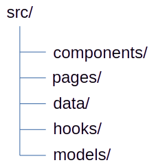

# Arborescence

  
# Description des composants  
* **Indicator**
	+ encart label + valeur numérique
	+ **props**: label, valeur numérique, couleur d'affichage de la valeur et marge inférieure optionnelle
	+ *dumb*
* **Header**
	+ Contient le titre de la page, un éventuel sous-titre, et des indicateurs
	+ **props**: titre, sous-titre (optionnel), liste de paramètres d'indicateur
	+ *dumb*
* **PieChart**
	+ Génère le diagramme circulaire
	+ **props**: liste de labels, liste de nombres
	+ *dumb*
* **Home**
	+ Page d'accueil. Inclut un Header et un PieChart.
	+ *smart* (appel de useData, calcul des paramètres à fournir au Header et au PieChart à partir des données)
* **Country**
	+ Page des détails par pays (pas utilisée dans ce projet)
* **data/olympicData**: 
	* tableau de données olympicsData
* **hooks/useData**:
	* Custom hooks qui gère l'appel aux données. Facilite l’intégration future d’un back-end.
* **models/types**:
	* déclaration des interfaces et types TypeScript