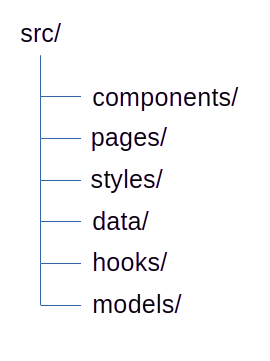

# Problèmes
- **App.tsx**: fichier trop volumineux.
- Données **olympicsData**  dans le fichier **App.tsx**.
- Type **any** déconseillé en typescript.
- Type **FC** déconseillé.
- Nom du composant **Home** différent du nom de fichier **App**.
- Dans **Home**, l'intégralité du fichier de données est mise dans le state => inutile.
- Répétition de 2 éléments sembables (*Pays participants*, *éditions des JO*) à mettre dans un composant séparé.
- Plusieurs composants dans le fichier **App**: Home, Country.
- Plusieurs *console.log* présents dans le code.

# Nouvelle architecture

- components:
	* Header
	* Indicator
	* PieChart
- pages:
	* Home
	* Country
- data: 
	* tableau de données olympicsData
- hooks:
	* useData pour centraliser toutes les données. Facilite l’intégration future d’un back-end.
- models:
	* interfaces et types TypeScript